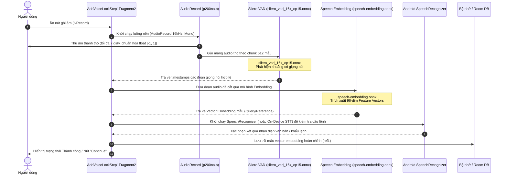

# Luồng Thiết lập Khóa giọng nói (Voice Lock Setup Flow)

Tài liệu này mô tả chi tiết toàn bộ quy trình kỹ thuật khi người dùng thực hiện thiết lập khóa giọng nói (Voice Lock Setup - Bước 1) trong ứng dụng **AI Voice Lock**.

---

## 1. Tổng quan kiến trúc luồng
Luồng thiết lập khóa giọng nói kết hợp giữa thu âm thô phần cứng (`AudioRecord`), mô hình phát hiện giọng nói AI (`Silero VAD`), mô hình trích xuất đặc trưng (`Speech Embedding`), kết hợp với hệ thống nhận diện giọng nói (`SpeechRecognizer`) của Android.

---

## 2. Sơ đồ tuần tự (Sequence Diagram)

---

## 3. Chi tiết các bước trong Flow

### Bước 1: Người dùng tương tác giao diện (`AddVoiceLockStep1Fragment2`)
- Người dùng nhìn thấy màn hình thiết lập bước 1 với văn bản hướng dẫn và nút micro (`ivRecord`).
- Khi người dùng ấn vào nút micro (`ivRecord`), fragment gọi hàm `c0()` để kiểm tra trạng thái và khởi chạy tiến trình ghi âm.

### Bước 2: Thu âm thanh thô phần cứng (`p200na.b`)
- Ứng dụng khởi tạo một phiên `AudioRecord`:
  - **Audio Source:** `MediaRecorder.AudioSource.VOICE_RECOGNITION`
  - **Sample Rate:** `16000` Hz (16kHz)
  - **Channel:** Mono (`16`)
  - **Format:** PCM 16-bit (`2`)
- Luồng nền (`Thread`) đọc dữ liệu âm thanh dạng `short[]`, chuyển đổi và chuẩn hóa thành mảng `float[]` (giá trị trong khoảng $[-1.0f, 1.0f]$) trong thời gian tối đa 7 giây.

### Bước 3: Phát hiện khoảng lặng & Cắt lọc giọng nói (`Silero VAD`)
- Mảng audio được chia nhỏ thành các khung 512 mẫu (`chunk512`).
- Mô hình **Silero VAD** (`models/silero_vad_16k_op15.onnx`) chạy qua **ONNX Runtime** với đầu vào là `input`, `sr` (16000), và `state`.
- Mô hình trả về xác suất giọng nói cho từng khung, giúp thuật toán xác định chính xác thời điểm bắt đầu (`start`) và kết thúc (`end`) của lời người dùng đọc.

### Bước 4: Trích xuất đặc trưng giọng nói (`Speech Embedding Model`)
- Đoạn audio đã được cắt lọc sạch sẽ tiếp tục được đưa qua mô hình **Speech Embedding** (`models/speech-embedding.onnx`).
- Mô hình trích xuất ra các **Vector đặc trưng toán học (Feature Vectors - 96 chiều)** đại diện cho âm sắc và đặc điểm giọng nói độc nhất của người dùng.

### Bước 5: Nhận diện khẩu lệnh bổ trợ (`Android SpeechRecognizer`)
- Song song hoặc kế tiếp, Android `SpeechRecognizer` (hoặc `createOnDeviceSpeechRecognizer`) được gọi để nhận diện nội dung câu nói (Speech-to-Text), đảm bảo người dùng nói đúng khẩu lệnh yêu cầu.

### Bước 6: Lưu trữ và Hoàn tất (`Success State`)
- Vector embedding hoàn chỉnh được lưu vào bộ nhớ cục bộ/cơ sở dữ liệu dưới dạng mẫu tham chiếu (`ref1`).
- Giao diện cập nhật (`X()`): Ẩn thanh tiến trình ghi âm, đổi thông báo sang trạng thái thành công (`R$string.f91675z3`), và bật sáng nút **"Continue"** để người dùng chuyển sang bước tiếp theo.
