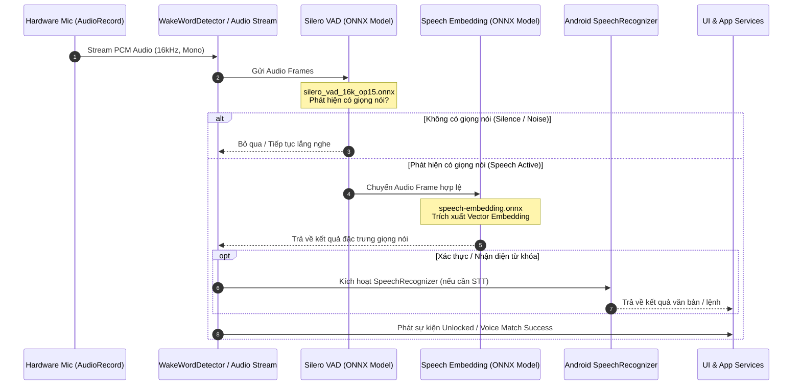

# Phân tích Kiến trúc & Logic Xử lý Âm thanh Giọng nói (VoiceOS - AI Tech Expe)

Tài liệu này tổng hợp các công nghệ, sơ đồ luồng hoạt động và chi tiết logic nhận diện, xử lý âm thanh giọng nói trong ứng dụng.

## 1. Các Công nghệ Sử dụng

| Thành phần | Công nghệ / Thư viện | Vai trò chính |
| :--- | :--- | :--- |
| **ML Runtime** | ONNX Runtime (`ai.onnxruntime`) | Chạy các mô hình Deep Learning offline (trên thiết bị) với JNI binding tối ưu hiệu năng. |
| **Voice Activity Detection (VAD)** | Silero VAD (`silero_vad_16k_op15.onnx`) | Phát hiện khoảng lặng, phân đoạn giọng nói và lọc tiếng ồn trước khi đưa vào mô hình nhận diện. |
| **Speaker Embedding** | Custom ONNX Model (`speech-embedding.onnx`) | Trích xuất đặc trưng giọng nói (vector embedding) để xác thực người nói (Voice Lock / Speaker Verification). |
| **Audio Capture** | Android `AudioRecord` | Thu âm thanh thô PCM (16kHz, Mono, 16-bit) trực tiếp từ microphone phần cứng. |
| **Speech-to-Text (STT)** | Android `SpeechRecognizer` | Nhận diện câu lệnh giọng nói, chuyển giọng nói thành văn bản cho các tính năng tương tác & ghi chú. |
| **Concurrency** | Kotlin Coroutines & Flows | Quản lý luồng bất đồng bộ, streaming audio buffer, watchdog timeout và cập nhật UI. |

---

## 2. Logic Nhận diện và Xử lý Âm thanh Giọng nói

Luồng xử lý giọng nói trong ứng dụng được chia thành các bước chính:

1. **Thu âm thanh thô (Audio Streaming)**:
   - [`WakeWordDetector.java`](file:///C:/code/jadx/VoiceOS%20-%20AI%20Tech%20Expe/app/src/main/java/com/voicelock/app/wakeword/WakeWordDetector.java) khởi tạo `AudioRecord` để thu luồng PCM liên tục từ mic.
   - Dữ liệu audio được chia thành các khung (frames) nhỏ để phân tích.

2. **Lọc tiếng ồn & Phát hiện giọng nói (VAD)**:
   - Các khung audio được đưa qua mô hình **Silero VAD** (`silero_vad_16k_op15.onnx`) thông qua `OrtSession`.
   - VAD xác định xem người dùng có đang thực sự nói hay không (Voice Active vs. Silence/Noise).

3. **Trích xuất đặc trưng & Nhận diện / Xác thực**:
   - Khi phát hiện giọng nói hợp lệ, audio được chuyển tiếp qua mô hình **Speech Embedding** (`speech-embedding.onnx`).
   - Mô hình ONNX tạo ra các tensor embedding đại diện cho đặc trưng giọng nói của người nói.
   - Hệ thống so khớp vector này với profile giọng nói đã được đăng ký trước đó (hoặc kiểm tra từ khóa đánh thức).

4. **Xử lý lệnh & Chuyển đổi văn bản (Speech Recognition)**:
   - Đối với các tính năng mở khóa bằng giọng nói hoặc tạo ghi chú (`VoiceNoteFragment`, `VoiceUnlockRecognizer`), ứng dụng kết hợp `SpeechRecognizer` để xử lý ngữ nghĩa và lệnh giọng nói.

---

## 3. Sơ đồ Luồng Xử lý Âm thanh (Workflow Diagram)

---

## 4. Các File Mã nguồn Cần Chú ý

- **`C:/code/jadx/VoiceOS - AI Tech Expe/app/src/main/java/com/voicelock/app/wakeword/WakeWordDetector.java`**: Quản lý vòng đời `AudioRecord` và điều phối luồng thu âm thời gian thực.
- **`C:/code/jadx/VoiceOS - AI Tech Expe/app/src/main/java/com/voicelock/app/service/overlay/VoiceUnlockRecognizer.java`**: Xử lý logic nhận diện giọng nói khi màn hình khóa thông qua `SpeechRecognizer`.
- **`C:/code/jadx/VoiceOS - AI Tech Expe/app/src/main/java/ai/onnxruntime/`**: Thư viện lõi ONNX Runtime Java (`OrtSession`, `OrtEnvironment`, `OrtLoraAdapter`) để chạy model offline.
- **Thư mục Assets Models**:
  - `silero_vad_16k_op15.onnx`: Mô hình phát hiện giọng nói (VAD).
  - `speech-embedding.onnx`: Mô hình trích xuất embedding giọng nói.
