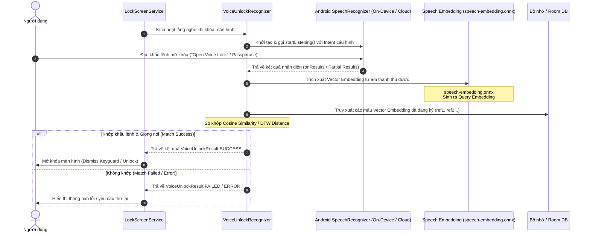

# Luồng Nhận diện Khẩu lệnh mở khóa (Voice Unlock Flow)

Tài liệu này mô tả chi tiết toàn bộ quy trình kỹ thuật khi ứng dụng thực hiện **Nhận diện Khẩu lệnh mở khóa (Voice Unlock / Wake Word Recognition)** trong ứng dụng **AI Voice Lock**.

---

## 1. Tổng quan kiến trúc luồng
Luồng mở khóa bằng giọng nói được quản lý bởi `LockScreenService` kết hợp với `VoiceUnlockRecognizer`. Luồng này kết hợp giữa hệ thống nhận diện giọng nói của Android (`SpeechRecognizer` / `OnDeviceSpeechRecognizer`) và hệ thống so khớp vector đặc trưng AI (`Speech Embedding` / `Silero VAD`) để xác thực chính xác giọng nói và khẩu lệnh của người dùng trước khi tiến hành mở khóa màn hình.

---

## 2. Sơ đồ tuần tự (Sequence Diagram)

---

## 3. Chi tiết các bước trong Flow

### Bước 1: Kích hoạt chế độ lắng nghe (`LockScreenService`)
- Khi màn hình thiết bị khóa (`LockScreen`), dịch vụ nền `LockScreenService` khởi động `VoiceUnlockRecognizer`.
- Kiểm tra quyền ghi âm (`RECORD_AUDIO`) và thiết lập các bộ đếm thời gian chờ (`armListenTimeout`, `armReadyWatchdog`).

### Bước 2: Bắt đầu lắng nghe giọng nói (`SpeechRecognizer`)
- `VoiceUnlockRecognizer` gọi `SpeechRecognizer.createOnDeviceSpeechRecognizer(context)` hoặc `createSpeechRecognizer(context)`.
- Cấu hình `RecognitionListener` và gọi `speechRecognizer.startListening(intent)` để bắt đầu thu âm giọng nói người dùng qua microphone.

### Bước 3: Nhận diện văn bản / Khẩu lệnh (`SpeechRecognizer Results`)
- Khi người dùng nói, `SpeechRecognizer` trả về các sự kiện:
  - `onReadyForSpeech`: Sẵn sàng thu âm.
  - `onResults`: Trả về danh sách các chuỗi văn bản nhận diện được (`Bundle results`).
- Nếu văn bản nhận diện khớp với câu lệnh cài đặt sẵn, hệ thống chuyển sang bước xác thực giọng nói sinh trắc học.

### Bước 4: So khớp đặc trưng giọng nói (`Speech Embedding Verification`)
- Đoạn âm thanh/kết quả được đưa qua mô hình `speech-embedding.onnx` để tạo **Query Embedding**.
- Hệ thống thực hiện tính toán khoảng cách hoặc độ tương đồng (`Cosine Similarity` / `DTW Distance`) giữa vector truy vấn này với các vector mẫu (`ref1`) đã lưu trong cơ sở dữ liệu khi thiết lập.

### Bước 5: Quyết định mở khóa (`VoiceUnlockResult`)
- **Thành công (`SUCCESS`):** Khẩu lệnh đúng và độ tương đồng giọng nói vượt ngưỡng tin cậy (`Threshold`), `VoiceUnlockRecognizer` kích hoạt callback trả về kết quả thành công, `LockScreenService` thực hiện lệnh mở khóa màn hình.
- **Thất bại (`FAILED` / `ERROR`):** Nếu sai khẩu lệnh hoặc giọng nói không khớp, hệ thống hiển thị thông báo lỗi hoặc yêu cầu người dùng thử lại.
